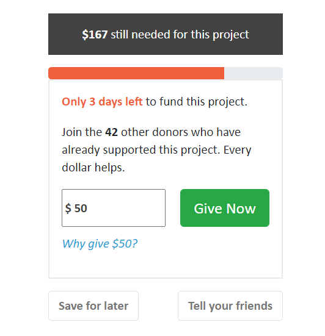

# Project Name
HTML, CSS, Bootstrap practice

## Table of contents
* [General info](#general-info)
* [Screenshots](#screenshots)
* [Technologies](#technologies)
* [Features](#features)
* [Status](#status)
* [Contact](#contact)

## General info
Recreated piece of a donation page to practice HTML, CSS and Bootstrap.

## Screenshots

## Technologies
* Tech 1 - HTML5
* Tech 2 - CSS3
* Tech 3 - Bootstrap 4.5.3.

## Features
List of features ready and TODOs for future development
* Input
* Buttons
* Responsive design

## Status
Project is: _finished_.

## Contact
Created by [csaba.farkas80@gmail.com] - feel free to contact me!
